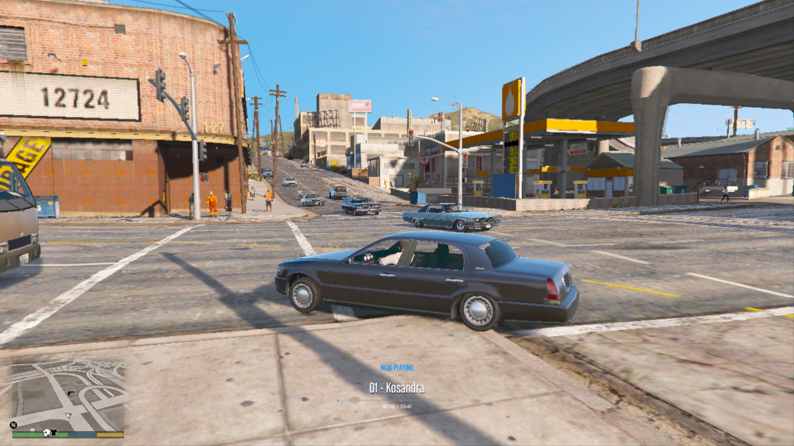
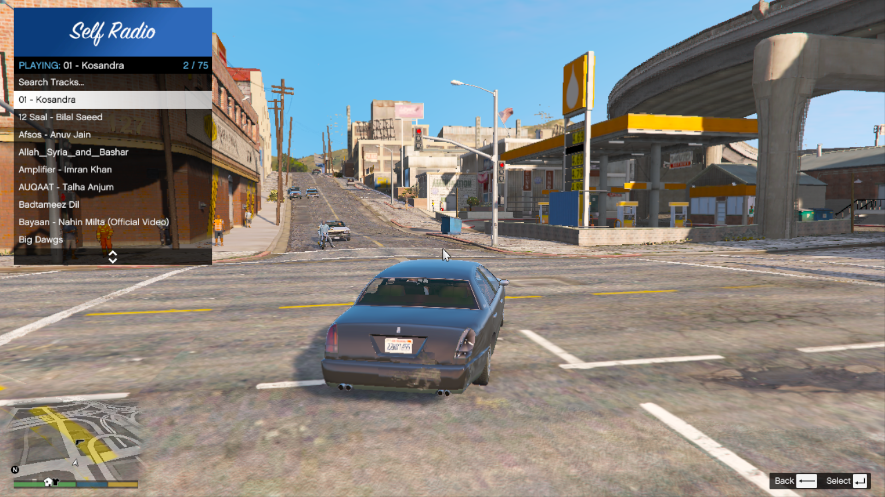

# Self Radio for GTA V (Proton, Linux, and Windows Compatible)

An implementation of a custom radio player for Grand Theft Auto V built using ScriptHookVDotNet and NAudio. This modification is fully optimized for native Windows installations as well as Linux systems running under Wine/Proton compatibility layers (such as the Steam Deck).

## Background and Motivation

The built-in "Self Radio" system provided by Rockstar Games frequently fails or causes performance instability on Linux environments. This is primarily caused by two factors:
1. **Media Foundation Dependencies:** The native game engine relies heavily on proprietary Windows Media Foundation (WMF) decoders to decode user MP3 and WAV files. Standard Proton prefixes often lack native support for these codecs, resulting in infinite scanning loops, silence, or sudden game crashes.
2. **File Pathing & Symbol Limitations:** Wine-based path virtualization behaves differently when handling symlinks, shortcuts, or files containing characters that are invalid in Windows but valid in Unix systems (such as the pipe symbol `|`). This causes the game's directory scanner to fail or throw exceptions.

This modification bypasses the Rockstar audio pipeline entirely. By utilizing the NAudio library directly inside the mono runtime of the game's active thread, audio files are read, parsed, and routed to the default system audio driver independently of WMF. Additionally, the file parser implements dynamic path resolution to safely detect directories on both OS filesystems.

---

## Features

- **Portability:** Instantly compatible across Windows, Linux, and Steam Deck.
- **Playback Style Selector:** Choose between "Vehicle-Only Playback" (automatically pauses on foot, remembers exact track position per individual vehicle) or "Play Everywhere" (play music on foot seamlessly across any context).
- **In-Game Search:** Filter your track list directly in-game using the GTA V native screen keyboard.
- **Visual Progress Bar HUD:** Display a high-fidelity timeline HUD showing real-time elapsed and total track duration.
- **Unified Visual Theme Manager:** Choose between five premium in-game color accents (Blue, Green, Red, Orange, and Purple) which dynamically update the volume bars, progress timelines, and HUD tags.
- **Dynamic Speed Volume Scaling (Speed-VC):** Automatically scales the radio volume up as your vehicle goes faster to combat engine, wind, and tire noise, and lowers it smoothly as you slow down.
- **Strict Smart Radio Override:** Automatically shuts off the standard in-game radio station whenever you enter a new vehicle and continuously prevents the player from manually changing the vehicle's default radio station.
- **Auto-Pause on Focus Loss & Pause Menu:** Playback is automatically paused when you exit active gameplay (ESC menu) or Alt-Tab out of the window, and resumes from the exact second as soon as focus is restored (integrated with Native Fiber threads).
- **Persistent State Saver:** Automatically remembers and resumes your volume, shuffle configurations, and last-played track index across game restarts.

---

## Screenshots

### In-Game HUD

<p align="center">
  
</p>

### Menu (bottom center)

<p align="center">
  
</p>


---

## Prerequisites

To run this mod, ensure you have the following files installed inside your Grand Theft Auto V main folder:

1. **ScriptHookV.dll** (Standard ASI Loader)
2. **ScriptHookVDotNet2.dll** (The .NET framework script runner)
3. **NativeUI.dll** (UI menu framework - placed in your `scripts` directory)
4. **NAudio.dll** (Audio decoding library - placed in your `scripts` directory)

---

## Installation

1. Copy `SelfRadioLinux.dll` and `SelfRadioLinux.ini` into your `scripts` directory (usually located at `C:\Program Files (x86)\Steam\steamapps\common\Grand Theft Auto V\scripts` or equivalent).
2. Place your audio files (`.mp3` or `.wav`) inside your default local GTA V user music directory:
   - **Linux/Proton Path:** `/home/<user>/.steam/steam/steamapps/compatdata/271590/pfx/drive_c/users/steamuser/Documents/Rockstar Games/GTA V/User Music`
   - **Windows Path:** `C:\Users\<user>\Documents\Rockstar Games\GTA V\User Music`
3. Launch the game and press the default menu key **J** to open the radio menu.

---

## Default Controls

You can change all hotkeys inside the generated `SelfRadioLinux.ini` configuration file or toggle options inside the settings menu:

| Control Action | Default Keybind |
| :--- | :--- |
| Open Radio Menu | `J` |
| Pause / Play Track | `O` |
| Next Song | `K` |
| Previous Song | `I` |
| Volume Up | `=` (Equals key - no Shift required) |
| Volume Down | `-` (Minus key) |
| Toggle Shuffle | `;` (Semicolon) |
| Seek Forward 5 seconds | `.` (Period) |
| Seek Backward 5 seconds | `,` (Comma) |

---

## Custom Compilation (For Linux Developers)

If you prefer to compile the script directly from source on a native Linux installation:

1. Ensure you have the `mono-devel` package installed on your distribution.
2. Open a terminal and navigate inside your `scripts` directory.
3. Run the compiler command:

```bash
mcs -target:library -out:SelfRadioLinux.dll \
    -r:../ScriptHookVDotNet2.dll \
    -r:NativeUI.dll \
    -r:NAudio.dll \
    -r:System.dll \
    -r:System.Core.dll \
    -r:System.Windows.Forms.dll \
    -r:System.Drawing.dll \
    SelfRadioLinux.cs
```

---

## Developer and Contact

- **Author:** Uzair Mughal
- **Developer Website:** [uzair.is-a.dev](https://uzair.is-a.dev)
- **GitHub Profile:** [uzairdeveloper223](https://github.com/uzairdeveloper223)
- **Contact Email:** contact@uzair.is-a.dev

---

## Credits

- Developed by **Uzair Mughal**
- **NAudio** audio processing library by Mark Heath & contributors.
- **NativeUI** UI menu framework by Guad.
- Special thanks to the ScriptHookVDotNet developer community.

---

## License

This project is licensed under the MIT License.  
See the [LICENSE](LICENSE) file for full details.

---

## Disclaimer

Please read the [DISCLAIMER.md](DISCLAIMER.md) file before using this project.

---

## Contributions

Contributions, improvements, bug fixes, and feature suggestions are always welcome.

If you would like to contribute:
1. Fork the repository
2. Create a new feature or fix branch
3. Commit your changes
4. Open a pull request

Please try to follow the existing code style and keep commits clear and organized.

---

## Issue Reporting

Feel free to report bugs, crashes, compatibility problems, or feature requests through the GitHub Issues page.

When reporting an issue, include:
- Your operating system and distribution
- GTA V version
- Proton/Wine version (if applicable)
- Steps to reproduce the issue
- Any crash logs or console output

This helps improve compatibility and stability across different systems.
