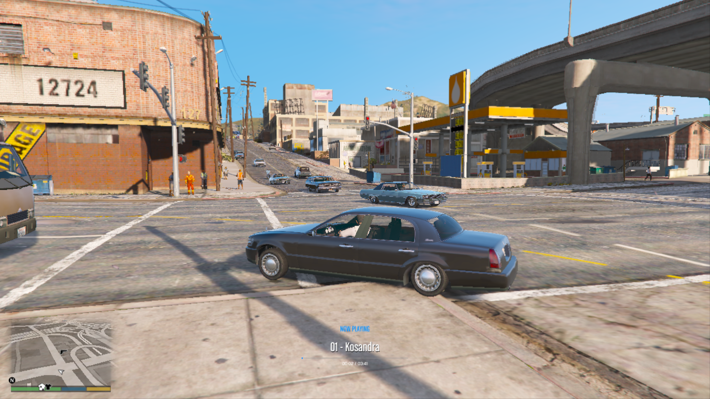
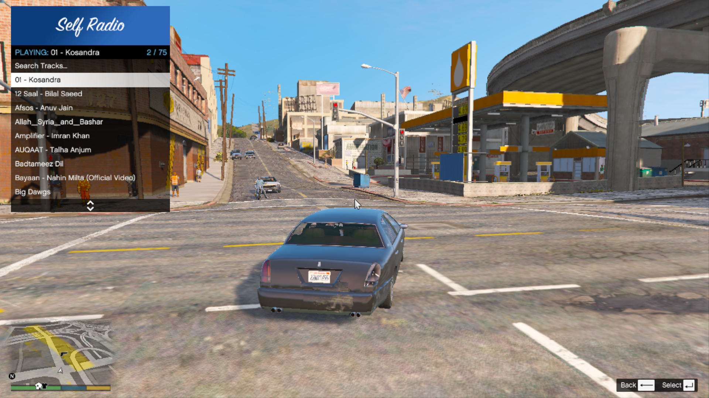

# Self Radio for GTA V (Proton, Linux, and Windows Compatible)

An implementation of a custom radio player for Grand Theft Auto V built using ScriptHookVDotNet and NAudio. This modification is fully optimized for native Windows installations as well as Linux systems running under Wine/Proton compatibility layers (such as the Steam Deck).

## Background and Motivation

The built-in "Self Radio" system provided by Rockstar Games frequently fails or causes performance instability on Linux environments. This is primarily caused by two factors:
1. **Media Foundation Dependencies:** The native game engine relies heavily on proprietary Windows Media Foundation (WMF) decoders to decode user MP3 and WAV files. Standard Proton prefixes often lack native support for these codecs, resulting in infinite scanning loops, silence, or sudden game crashes.
2. **File Pathing & Symbol Limitations:** Wine-based path virtualization behaves differently when handling symlinks, shortcuts, or files containing characters that are invalid in Windows but valid in Unix systems (such as the pipe symbol `|`). This causes the game's directory scanner to fail or throw exceptions.

This modification bypasses the Rockstar audio pipeline entirely. By utilizing the NAudio library directly inside the mono runtime of the game's active thread, audio files are read, parsed, and routed to the default system audio driver independently of WMF. Additionally, the file parser implements dynamic path resolution to safely detect directories on both OS filesystems.

---

## Features

- **Portability:** Instantly compatible across Windows, Linux, and Steam Deck.
- **Zero-Impact Startup (Lazy Loading):** The mod performs absolutely **no file I/O during game initialization or world loading**. Directories are only read on-demand when you actually open the radio menu and navigate into a folder. This eliminates the world-load crashes and stuttering that plague other music mods, especially under Wine/Proton where recursive directory scanning is extremely expensive.
- **Dynamic Nested Folder Browser:** Navigate through your entire music library directly in-game. The mod displays only the **immediate contents** of the folder you are currently viewing. Subfolders are listed but **never scanned until you actually click into them**. A simple `.. (Back)` option lets you navigate up the directory tree. This ensures lightning-fast menu performance even with massive 500+ track libraries across 70+ nested directories.
- **Smart File Filtering:** Automatically skips unsupported video and audio container formats (such as `.mp4`, `.mkv`, `.m4a`, `.webm`, `.oga`, `.opus`) and only loads native `.mp3` and `.wav` files. This prevents Proton/NAudio crashes, avoids unnecessary dependencies, and keeps your track lists clean.
- **Contextual Folder Playlists:** When you enter a specific subfolder (e.g., "Gangs Songs" or "funk") and play a track, the "Next", "Previous", and "Shuffle" functions are intelligently scoped to *only* the tracks inside that specific directory.
- **Persistent Directory State:** Automatically remembers your exact last-browsed folder and the last-played track path across game restarts, dropping you right back where you left off.
- **Cross-Platform Path Normalization:** All file paths are normalized to use consistent forward slashes regardless of whether the game is running on Windows or Linux/Wine. This prevents the mixed-separator path bugs (`/home/user\Songs\folder`) that cause navigation failures and prevent going back to parent directories under Wine/Proton.
- **Playback Style Selector:** Choose between "Vehicle-Only Playback" (automatically pauses on foot, remembers exact track position per individual vehicle) or "Play Everywhere" (play music on foot seamlessly across any context).
- **3D Exterior Audio (Positional Sound Engine):** When you step out of a vehicle while your music is still playing, playback does not stop. The audio continues to emit from the car's real-world position in the game world — dynamically panned left/right relative to your camera direction and smoothly attenuated with a distance-based falloff curve — simulating a genuine external car stereo. Re-entering the anchored vehicle seamlessly restores full-volume stereo playback.
- **Live Distance HUD & Audible Range:** While music is broadcasting from an exterior vehicle, a dedicated on-screen indicator displays your real-time distance from the source ("XXm FROM THE CAR" / "OUT OF RANGE"). The maximum audible distance is fully configurable through the `MaxAudibleDistance` INI setting.
- **Auto-Play on Vehicle Entry:** Optionally begins playing your custom music automatically the instant you enter any vehicle, so your radio is always live without pressing a single key.
- **In-Game Search:** Filter your track list directly in-game using the GTA V native screen keyboard. The recursive library scan is deferred and only performed the first time you actually trigger a search, then cached for instant subsequent searches.
- **Visual Progress Bar HUD:** Display a high-fidelity timeline HUD showing real-time elapsed and total track duration.
- **Unified Visual Theme Manager:** Choose between five premium in-game color accents (Blue, Green, Red, Orange, and Purple) which dynamically update the volume bars, progress timelines, visualizer bars, and HUD tags.
- **Dynamic Speed Volume Scaling (Speed-VC):** Automatically scales the radio volume up as your vehicle goes faster to combat engine, wind, and tire noise, and lowers it smoothly as you slow down.
- **Strict Smart Radio Override:** Automatically shuts off the standard in-game radio station whenever you enter a new vehicle and continuously prevents the player from manually changing the vehicle's default radio station.
- **Auto-Pause on Focus Loss & Pause Menu:** Playback is automatically paused when you exit active gameplay (ESC menu) or Alt-Tab out of the window, and resumes from the exact second as soon as focus is restored (integrated with Native Fiber threads).
- **Persistent State Saver:** Automatically remembers and resumes your volume, shuffle configurations, repeat mode, visualizer settings, and last-played track index across game restarts.
- **Repeat Modes:** Cycle between Off, Repeat One, and Repeat All directly from the settings menu or a dedicated hotkey (`R`), controlling exactly what happens when a track finishes naturally. When Repeat is Off and the track is not the last in the folder, it auto-forwards to the next song. When it reaches the last song, playback stops.
- **Track Metadata Display:** Reads embedded ID3v2 and ID3v1 tags from your MP3 files and shows the real "Artist - Title" in the menu and HUD instead of the raw filename, falling back automatically when no tags are present.
- **Favorites System:** Star any track from the menu or with a single keypress (`F`). Favorited tracks are marked with a highlighted icon in the list and can be browsed through a dedicated "Favorites" virtual folder accessible from the root menu. Favorites are persisted to a separate `SelfRadioLinux.favorites` file.
- **Spectrum Visualizer:** A small animated frequency bar visualizer renders on screen, driven by a lightweight real-time FFT tapped directly from the live audio stream. Toggle it on/off with the `V` key or from the settings menu.
- **Visualizer Position Selector:** Choose where the spectrum visualizer appears on screen: Above HUD, Below HUD, Top Center, Bottom Center, Left Side (vertical bars), or Right Side (vertical bars). Configurable from the settings menu and persisted in the INI.
- **Visualizer Always Visible:** When enabled, the spectrum visualizer bars stay on screen the entire time music is playing, even after the song title, progress bar, and "NOW PLAYING" text fade out. When disabled, the visualizer follows the same fade timer as the rest of the HUD.
- **Distance-Based Low-Pass Filter:** Stacks on top of the existing 3D Exterior Audio system. As you move farther from the anchored vehicle, high frequencies are progressively rolled off through a real-time low-pass filter, so the car stereo sounds increasingly muffled at range instead of just quieter.
- **Proton/Mono Safe Architecture:** All generic collections use `List<T>` and `Dictionary<K,V>` instead of `Stack<T>` to avoid Mono JIT type-resolution bugs (`TypeLoadException`) that cause crashes under Wine/Proton. The entire codebase is designed to be safe for the embedded Mono runtime used by ScriptHookVDotNet on Linux.

---

## Screenshots

### In-Game HUD (bottom center)

<p align="center">
  
</p>

### Menu

<p align="center">
  
</p>


---

## Prerequisites

To run this mod, ensure you have the following files installed inside your Grand Theft Auto V main folder:

1. **ScriptHookV.dll** (Standard ASI Loader)
2. **ScriptHookVDotNet2.dll** (The .NET framework script runner)
3. **NativeUI.dll** (UI menu framework - placed in your `scripts` directory)
4. **NAudio.dll** (Audio decoding library - placed in your `scripts` directory)

---

## Installation

1. Copy `SelfRadioLinux.dll` and `SelfRadioLinux.ini` into your `scripts` directory (usually located at `C:\Program Files (x86)\Steam\steamapps\common\Grand Theft Auto V\scripts` or equivalent).
2. Place your audio files (`.mp3` or `.wav`) inside your default local GTA V user music directory:
   - **Linux/Proton Path:** `/home/<user>/.steam/steam/steamapps/compatdata/271590/pfx/drive_c/users/steamuser/Documents/Rockstar Games/GTA V/User Music`
   - **Windows Path:** `C:\Users\<user>\Documents\Rockstar Games\GTA V\User Music`
3. You can also point `MusicDir` in the INI to any custom folder (e.g., your main music library at `/home/<user>/Music/Songs`).
4. Launch the game and press the default menu key **J** to open the radio menu. Use the menu to navigate into your organized subfolders.

---

## Default Controls

You can change all hotkeys inside the generated `SelfRadioLinux.ini` configuration file or toggle options inside the settings menu:

| Control Action | Default Keybind |
| :--- | :--- |
| Open Radio Menu | `J` |
| Pause / Play Track | `O` |
| Next Song | `K` |
| Previous Song | `I` |
| Volume Up | `=` (Equals key - no Shift required) |
| Volume Down | `-` (Minus key) |
| Toggle Shuffle | `;` (Semicolon) |
| Seek Forward 5 seconds | `.` (Period) |
| Seek Backward 5 seconds | `,` (Comma) |
| Cycle Repeat Mode | `R` |
| Toggle Favorite (current track) | `F` |
| Toggle Spectrum Visualizer | `V` |

---

## Custom Compilation (For Linux Developers)

If you prefer to compile the script directly from source on a native Linux installation:

1. Ensure you have the `mono-devel` package installed on your distribution.
2. Open a terminal and navigate inside your `scripts` directory.
3. Run the compiler command:

```bash
mcs -target:library -out:SelfRadioLinux.dll \
    -r:../ScriptHookVDotNet2.dll \
    -r:NativeUI.dll \
    -r:NAudio.dll \
    -r:System.dll \
    -r:System.Core.dll \
    -r:System.Windows.Forms.dll \
    -r:System.Drawing.dll \
    SelfRadioLinux.cs
```

---

## Developer and Contact

- **Author:** Uzair Mughal
- **Developer Website:** [uzair.is-a.dev](https://uzair.is-a.dev)
- **GitHub Profile:** [uzairdeveloper223](https://github.com/uzairdeveloper223)
- **Contact Email:** contact@uzair.is-a.dev

---

## Credits

- Developed by **Uzair Mughal**
- **NAudio** audio processing library by Mark Heath & contributors.
- **NativeUI** UI menu framework by Guad.
- Special thanks to the ScriptHookVDotNet developer community.

---

## License

This project is licensed under the MIT License.
See the [LICENSE](LICENSE) file for full details.

---

## Disclaimer

Please read the [DISCLAIMER.md](DISCLAIMER.md) file before using this project.

---

## Contributions

Contributions, improvements, bug fixes, and feature suggestions are always welcome.

If you would like to contribute:
1. Fork the repository
2. Create a new feature or fix branch
3. Commit your changes
4. Open a pull request

Please try to follow the existing code style and keep commits clear and organized.

---

## Issue Reporting

Feel free to report bugs, crashes, compatibility problems, or feature requests through the GitHub Issues page.

When reporting an issue, include:
- Your operating system and distribution
- GTA V version
- Proton/Wine version (if applicable)
- Steps to reproduce the issue
- Any crash logs or console output (e.g., `ScriptHookVDotNet.log`)

This helps improve compatibility and stability across different systems.
